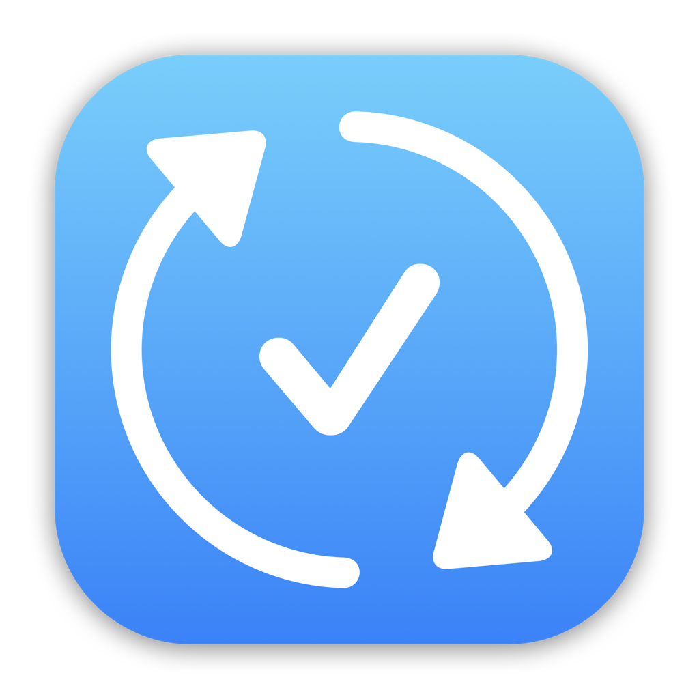

<h1 align="center">
    
    <br />
    <b>TaskSync: Task Manager</b>
</h1>

<div align="center">
    <a href="https://developer.apple.com">
        
    </a>
    <a href="https://buymeacoffee.com/paulrodenjr">
        
    </a>
    <a href="https://github.com/RodenPaul86/TaskSync/blob/main/LICENSE">
        
    </a>
</div>

<br />

<p align="center">
    <a href="#download">Download</a>
    •
    <a href="#motivation">Motivation</a>
    •    
    <a href="#features">Features</a>
    •    
    <a href="#requirements">Requirements</a>
    •    
    <a href="#screenshots">Screenshots</a>
    •
    <a href="#support">Dependencies</a>
    •
    <a href="#support">Support</a>
    •    
    <a href="#license">License</a>
</p>

## Download

<div align="center">
    <h4><b>You can get TaskSync from one of the links below! 👇</b></h4>
    <a href="https://apps.apple.com/us/app/tasksync-task-manager/id6737742961">
        
    </a>
    <a href="https://github.com/RodenPaul86/TaskSync/releases/tag/v1.0.0">
        
</div>

## Motivation

<p>
There are plenty of task management apps out there, but only a few strike the right balance—TaskSync is one of them.
Built to be fast, intuitive, and minimal, TaskSync focuses on what matters: helping you stay organized without getting in your way. No clutter, no distractions—just a clean, thoughtful experience designed around your daily workflow.

Part of my [portfolio projects](https://paulrodenjr.org), TaskSync reflects my approach to iOS development—delivering practical tools that feel effortless to use.
</p>

## Features

- Ad-free.
- Regular, Strobing, and Flashing LED Light.
- Screen Light: The user uses the screen for light.
- On-board map with turn-by-turn directions.
- Morse Code.

## Requirements

- Xcode 14.3.1
- iOS 12+

## Screenshots

<div align="left">
    <h3><b>iOS:</b></h3>
    <div align="left">
    
    </a>
    
    </a>
    
    </a>
</div>

## Cocoapods
```swift
dependencies: [
    .package(url: "https://github.com/RevenueCat/purchases-ios.git", from: "5.21.1")
]
```

## Support

I began my journey as an independent developer nearly a decade ago, and TaskSync is the result of years of growth, experimentation, and learning along the way. While I’ve explored many side projects, TaskSync has become a true passion—my way of helping people stay focused, organized, and in control of their day.

I’m committed to evolving TaskSync with thoughtful updates, new features, and ongoing improvements. The support from users like you means everything—it’s what makes this journey possible and keeps TaskSync moving forward.

<p><a href="https://www.buymeacoffee.com/paulrodenjr"> </a></p><br><br>
<br/>

Thank you!

## License
TaskSync is written in (Swift) and is distributed under the terms of the [Apache License](https://github.com/RodenPaul86/TaskSync/blob/main/LICENSE) (Version 2.0).

